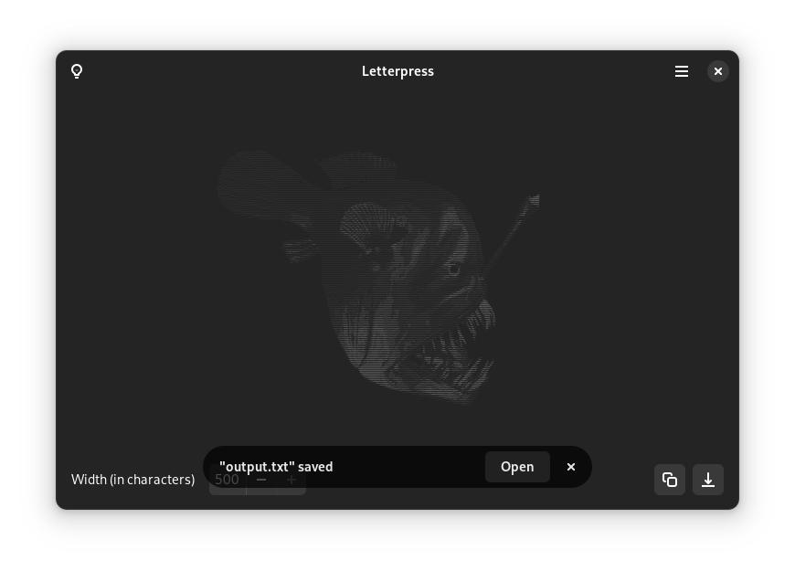

# Letterpress

Letterpress uses [jp2a](https://github.com/Talinx/jp2a) to turn your pictures into images made up of ASCII Characters.

  

## Installation

The currently supported method of installation is via Flathub:

## Development

The easiest way to work on this project is by cloning it with GNOME Builder:

1. Install and open [GNOME Builder](https://flathub.org/apps/details/org.gnome.Builder)
2. Select "Clone Repository..."
3. Clone `https://gitlab.com/gregorni/letterpress.git` (or your fork)
4. Run the project with the ▶ button at the top, or by pressing `Ctrl`+`Shift`+`Space`.

## Code of Conduct

This project follows the [GNOME Code of Conduct](https://wiki.gnome.org/Foundation/CodeOfConduct)

